# Architecture Documentation

## System Overview

The Topcoder Skills Recommender is a CLI tool that analyzes GitHub user profiles and recommends Topcoder standardized skills based on deep analysis of repositories, commits, pull requests, and code contributions.

## High-Level Architecture

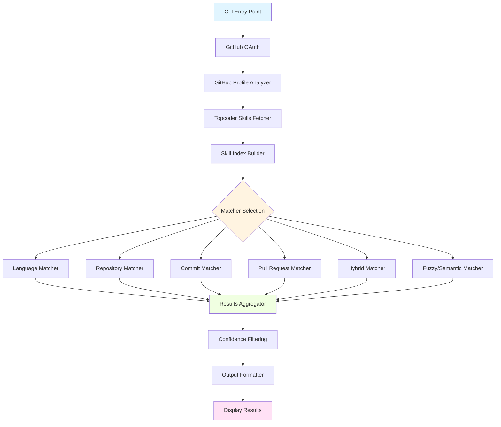

## Data Flow

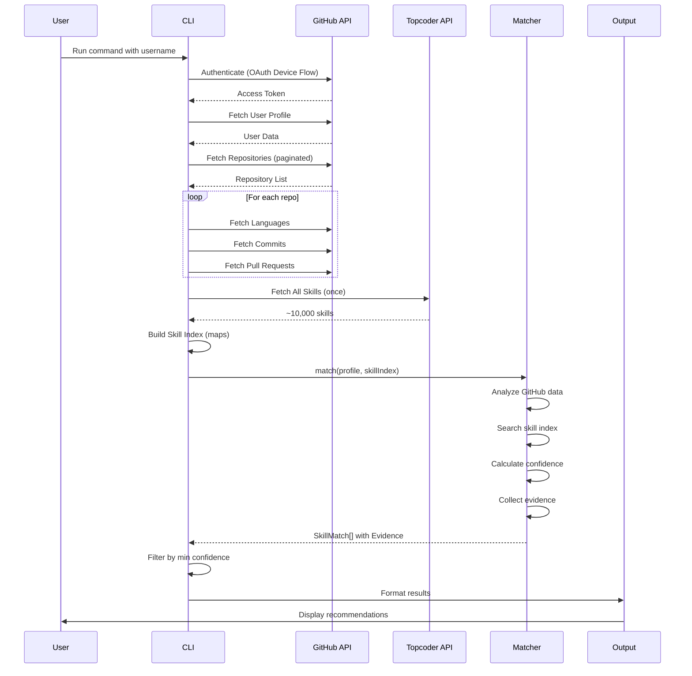

## Component Architecture

### 1. Core Components

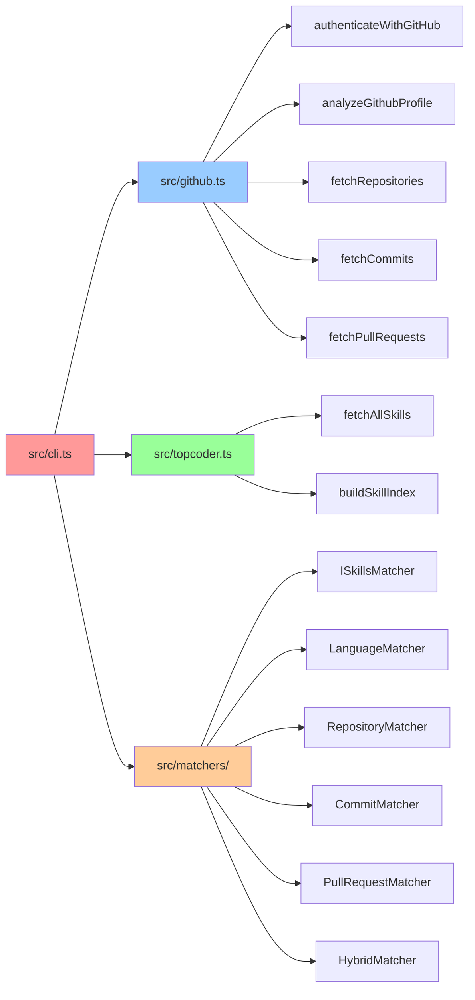

### 2. Skill Index Structure

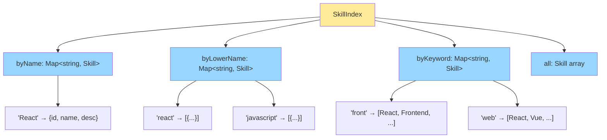

**Index Building Process:**
1. Exact name: `"React"` → Direct O(1) lookup
2. Case-insensitive: `"react"` → Array of matches
3. Keywords: Split skill name and description into words → Map word to skills
4. Enables multi-strategy matching without repeated API calls

### 3. Matcher Interface

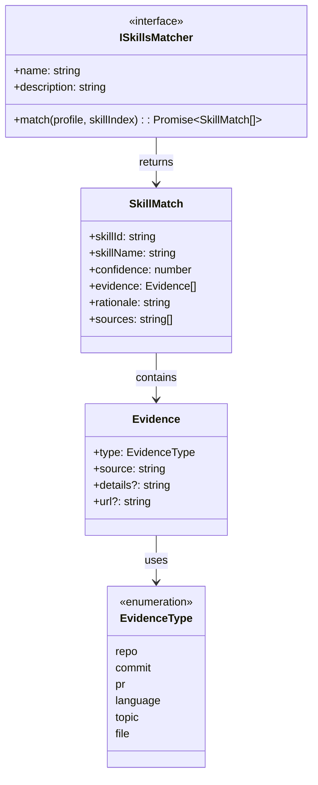

**Key Interfaces:**
- **ISkillsMatcher**: Contract all matchers must implement
- **SkillMatch**: Skill recommendation with confidence score
- **Evidence**: Proof from GitHub (repos, commits, PRs)
- **EvidenceType**: Classification of evidence source

## Matcher Algorithms

### 1. Language Matcher (Most Reliable)

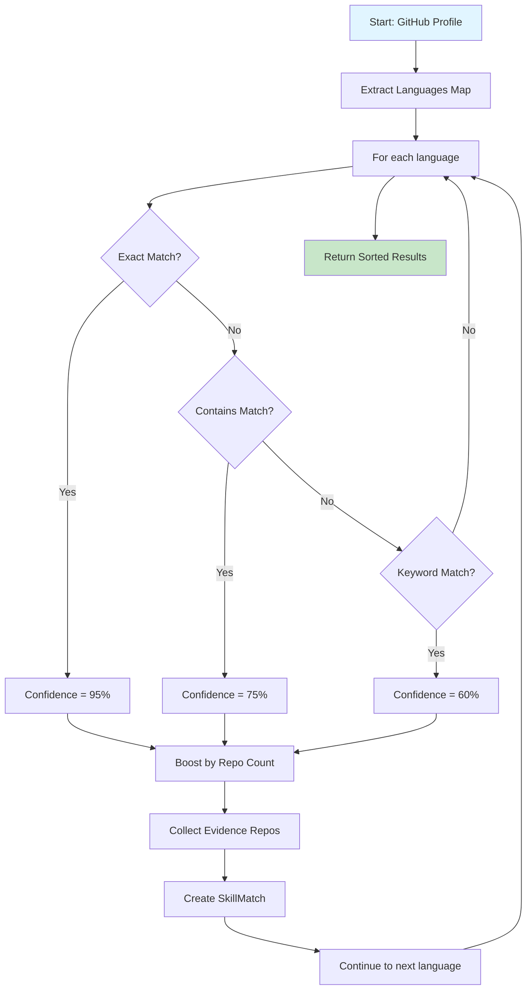

**Algorithm:**
```
1. Extract: profile.languages → Map<string, number>
2. For each language:
   a. Exact match: "JavaScript" === skill.name → 95%
   b. Partial: "JavaScript" in skill.name → 75%
   c. Related: skill keywords contain "javascript" → 60%
3. Boost: +2% per repo (max +20%)
4. Evidence: List top 5 repos using this language
5. Return: Sorted by confidence (desc)
```

### 2. Repository Matcher

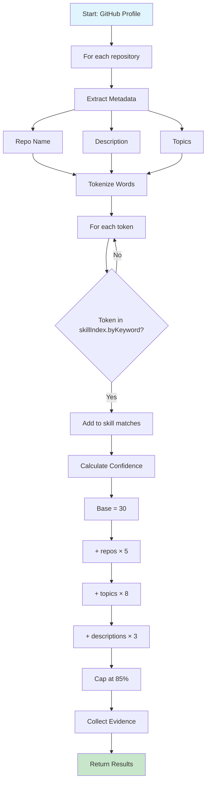

**Confidence Formula:**
```
confidence = min(30 + (matching_repos × 5) + (topics × 8) + (descriptions × 3), 85)
```

### 3. Commit Matcher

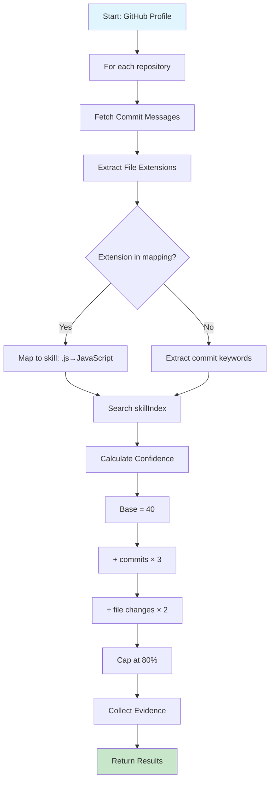

**File Extension Mapping:**
```typescript
'.js' | '.jsx' → 'JavaScript'
'.ts' | '.tsx' → 'TypeScript'
'.py' → 'Python'
'.java' → 'Java'
'.go' → 'Go'
'.rs' → 'Rust'
// ... etc
```

### 4. Pull Request Matcher

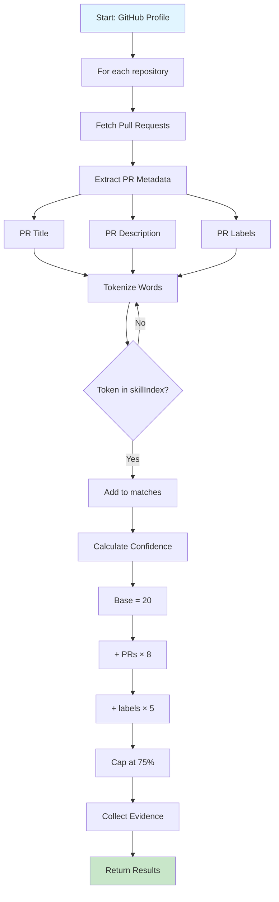

### 5. Hybrid Matcher (Recommended)

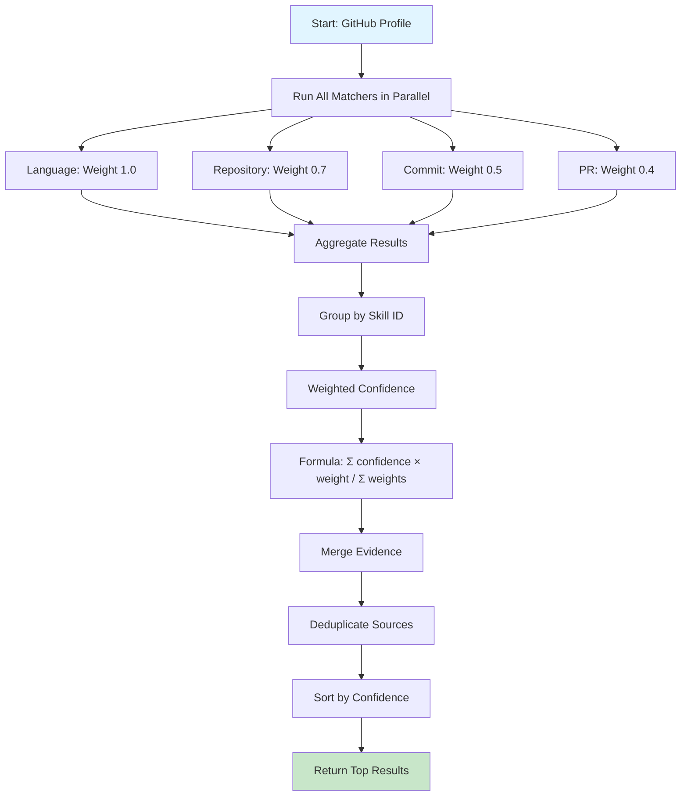

**Weighted Combination:**
```
For each skill found by multiple matchers:
weighted_confidence = (
    language_confidence × 1.0 +
    repo_confidence × 0.7 +
    commit_confidence × 0.5 +
    pr_confidence × 0.4
) / total_weights_used
```

## Confidence Scoring System

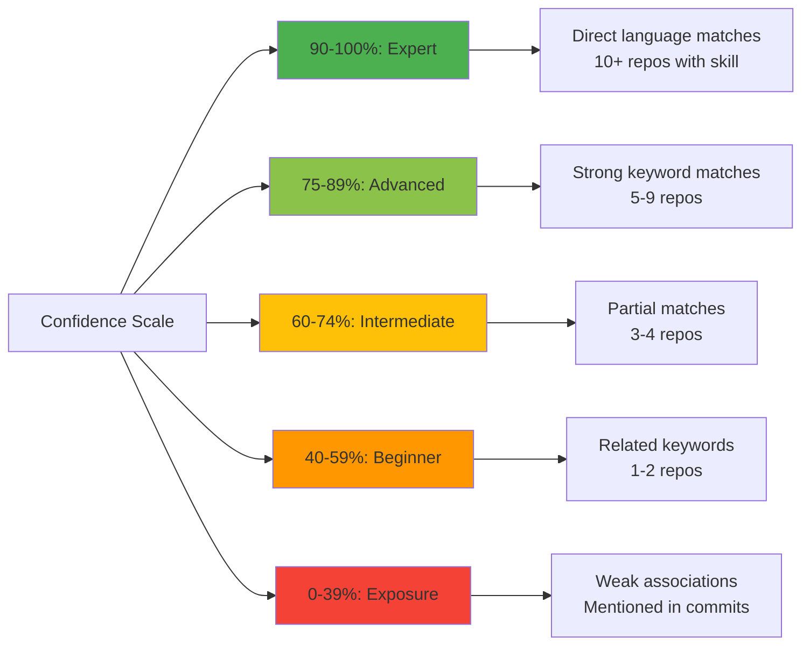

## Performance Optimization

### Skill Index Strategy

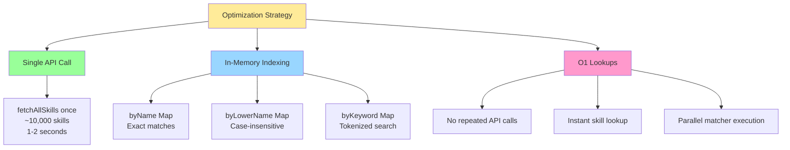

**Before vs After:**
- **Before**: 100+ API calls per user (fuzzy match, semantic search for each language)
- **After**: 1 API call per session (fetch all skills once, match locally)
- **Speed**: 10-30 seconds → 2-5 seconds
- **Reliability**: Network failures → None (local matching)

## Error Handling

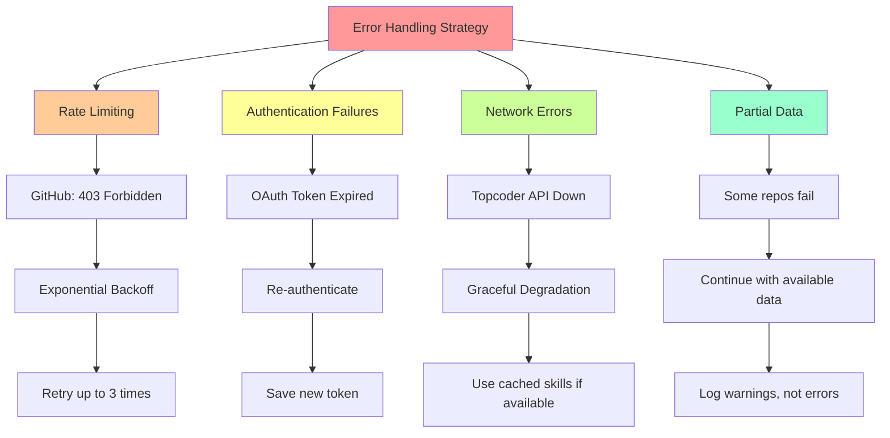

## Output Formats

### Text Format
```
🎯 Topcoder Skill Recommendations for octocat
═══════════════════════════════════════════

1. JavaScript (98% confidence)
   Evidence:
   • Language: frontend-app (42 contributions)
   • Language: backend-api (38 contributions)
   • Repository: js-toolkit (topic: javascript)
   Found by: Language Matcher, Repository Matcher

2. React (95% confidence)
   Evidence:
   • Language: react-dashboard (56 contributions)
   • Repository: react-components (description: "React UI library")
   Found by: Language Matcher, Hybrid Matcher
```

### JSON Format
```json
{
  "username": "octocat",
  "matcher": "hybrid",
  "minConfidence": 50,
  "recommendations": [
    {
      "skillId": "abc123",
      "skillName": "JavaScript",
      "confidence": 98,
      "evidence": [
        {
          "type": "language",
          "source": "frontend-app",
          "details": "42 contributions",
          "url": "https://github.com/octocat/frontend-app"
        }
      ],
      "rationale": "Exact language match with high frequency",
      "sources": ["Language Matcher", "Repository Matcher"]
    }
  ]
}
```

## CLI Interface

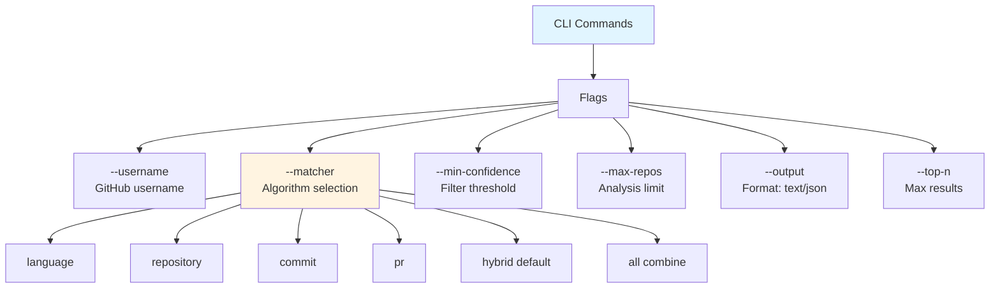

**Example Usage:**
```bash
# Default (hybrid matcher, min 50% confidence)
npm start -- --username octocat

# Language-only matching
npm start -- --username octocat --matcher language

# High confidence only
npm start -- --username octocat --min-confidence 75

# JSON output for API integration
npm start -- --username octocat --output json > results.json

# Run all matchers and combine
npm start -- --username octocat --matcher all --top-n 20
```

## Security & Privacy

- **OAuth Token Storage**: Stored in `.github-token` file (gitignored)
- **No Data Persistence**: GitHub profile data not stored, processed in-memory only
- **API Keys**: Environment variables for any optional AI providers
- **Rate Limits**: Respects GitHub API limits (5000/hour authenticated)

## Extensibility

The architecture supports easy addition of new matchers - see [PLUGIN_GUIDE.md](PLUGIN_GUIDE.md) for step-by-step instructions.
