# Architecture Documentation

## System Overview

The Topcoder Skills Recommender is a CLI tool that analyzes GitHub user profiles and recommends Topcoder standardized skills based on deep analysis of repositories, commits, pull requests, and code contributions.

## High-Level Architecture

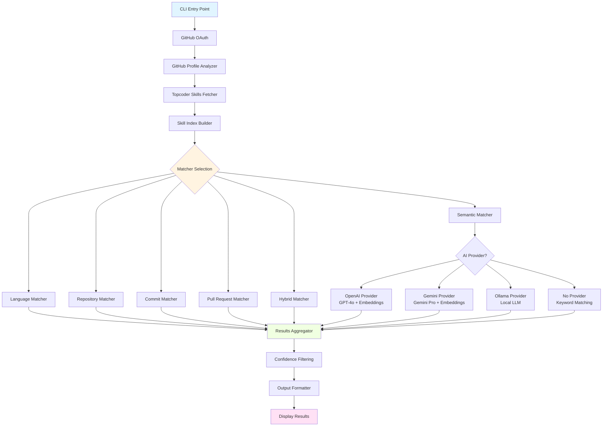

## Data Flow

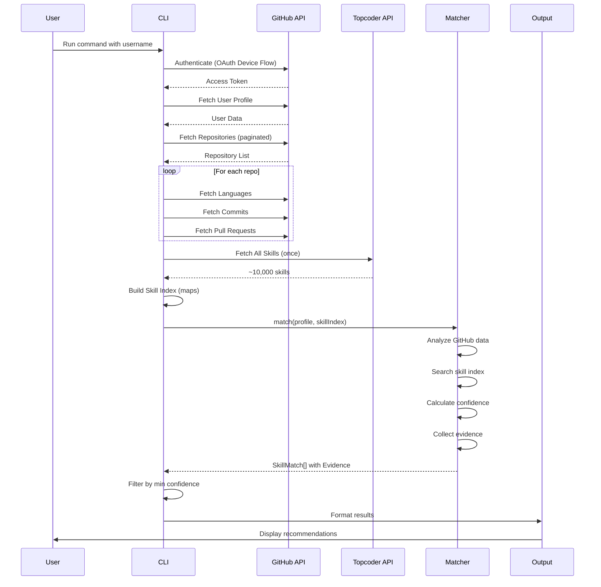

## Component Architecture

### 1. Core Components

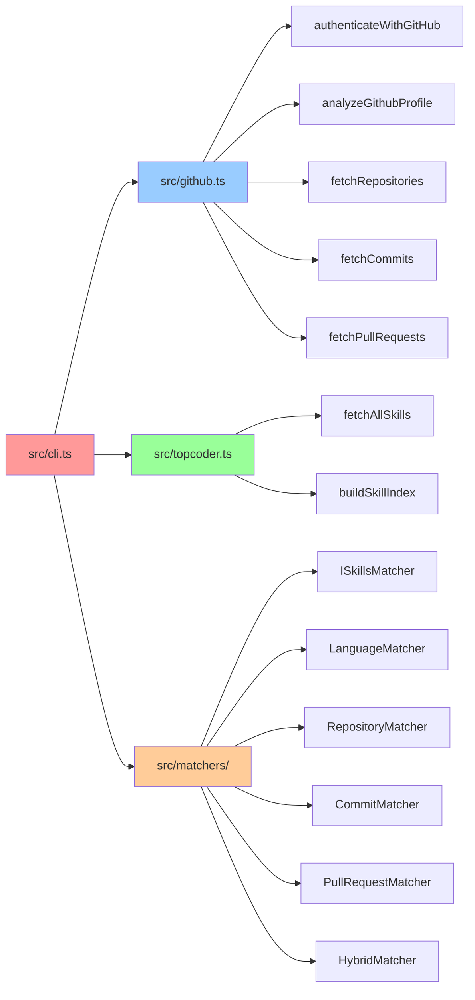

### 2. AI Provider Architecture

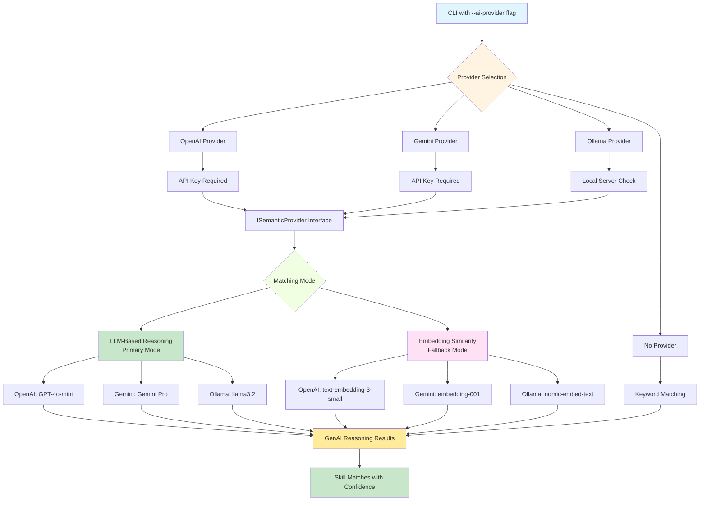

**AI Provider Features:**

| Provider | Type | LLM Model | Embedding Model | Privacy | Cost |
|----------|------|-----------|-----------------|---------|------|
| **OpenAI** | Cloud | GPT-4o-mini | text-embedding-3-small | ❌ Cloud | $0.15-$0.20 per analysis |
| **Gemini** | Cloud | Gemini Pro | embedding-001 | ❌ Cloud | $0.10-$0.15 per analysis |
| **Ollama** | Local | llama3.2 | nomic-embed-text | ✅ 100% Local | Free |
| **None** | N/A | N/A | N/A | ✅ No AI | Free |

**Dual-Mode Matching:**
1. **LLM-Based Reasoning (Primary)** - Uses GenAI to understand context and infer skills
2. **Embedding Similarity (Fallback)** - Uses vector embeddings for semantic matching
3. **Keyword Matching (Last Resort)** - Basic text matching when AI unavailable

### 3. Skill Index Structure

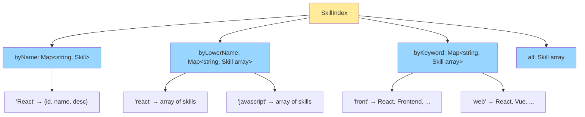

**Index Building Process:**
1. Exact name: `"React"` → Direct O(1) lookup
2. Case-insensitive: `"react"` → Array of matches
3. Keywords: Split skill name and description into words → Map word to skills
4. Enables multi-strategy matching without repeated API calls

### 3. Matcher Interface

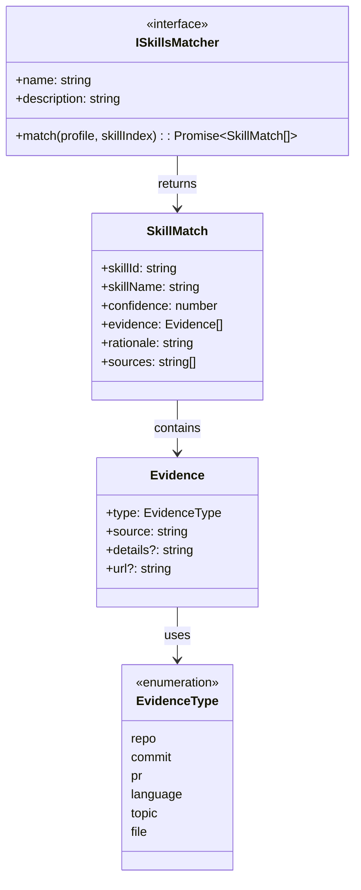

**Key Interfaces:**
- **ISkillsMatcher**: Contract all matchers must implement
- **SkillMatch**: Skill recommendation with confidence score
- **Evidence**: Proof from GitHub (repos, commits, PRs)
- **EvidenceType**: Classification of evidence source

## Matcher Algorithms

### 1. Language Matcher (Most Reliable)

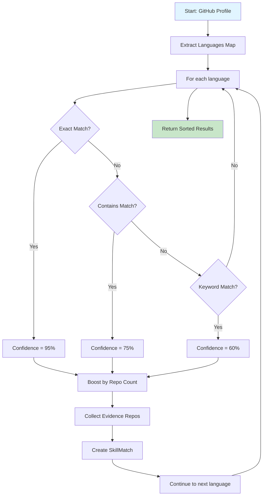

**Algorithm:**
```
1. Extract: profile.languages → Map<string, number>
2. For each language:
   a. Exact match: "JavaScript" === skill.name → 95%
   b. Partial: "JavaScript" in skill.name → 75%
   c. Related: skill keywords contain "javascript" → 60%
3. Boost: +2% per repo (max +20%)
4. Evidence: List top 5 repos using this language
5. Return: Sorted by confidence (desc)
```

### 2. Repository Matcher

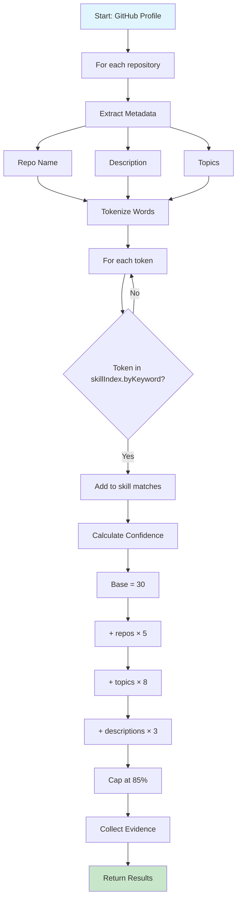

**Confidence Formula:**
```
confidence = min(30 + (matching_repos × 5) + (topics × 8) + (descriptions × 3), 85)
```

### 3. Commit Matcher

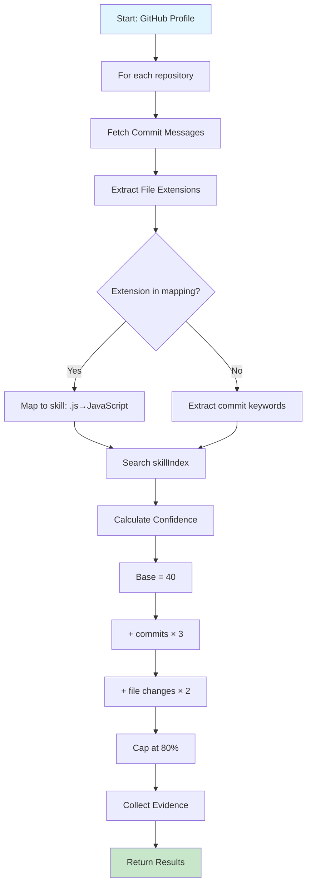

**File Extension Mapping:**
```typescript
'.js' | '.jsx' → 'JavaScript'
'.ts' | '.tsx' → 'TypeScript'
'.py' → 'Python'
'.java' → 'Java'
'.go' → 'Go'
'.rs' → 'Rust'
// ... etc
```

### 4. Pull Request Matcher

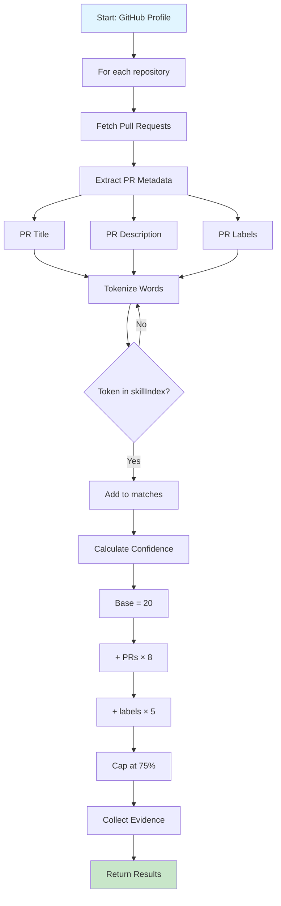

### 5. Hybrid Matcher (Recommended)

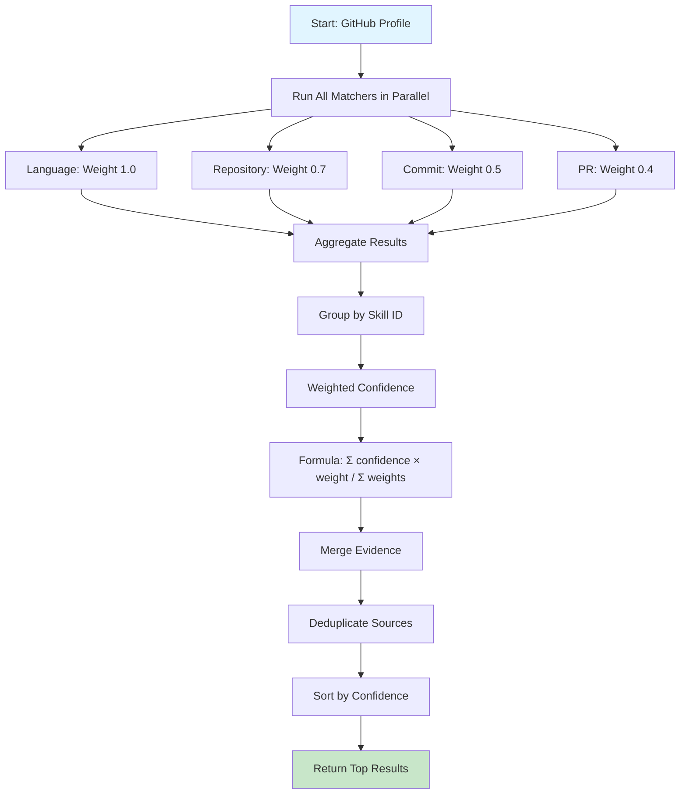

**Weighted Combination:**
```
For each skill found by multiple matchers:
weighted_confidence = (
    language_confidence × 1.0 +
    repo_confidence × 0.7 +
    commit_confidence × 0.5 +
    pr_confidence × 0.4
) / total_weights_used
```

## Confidence Scoring System

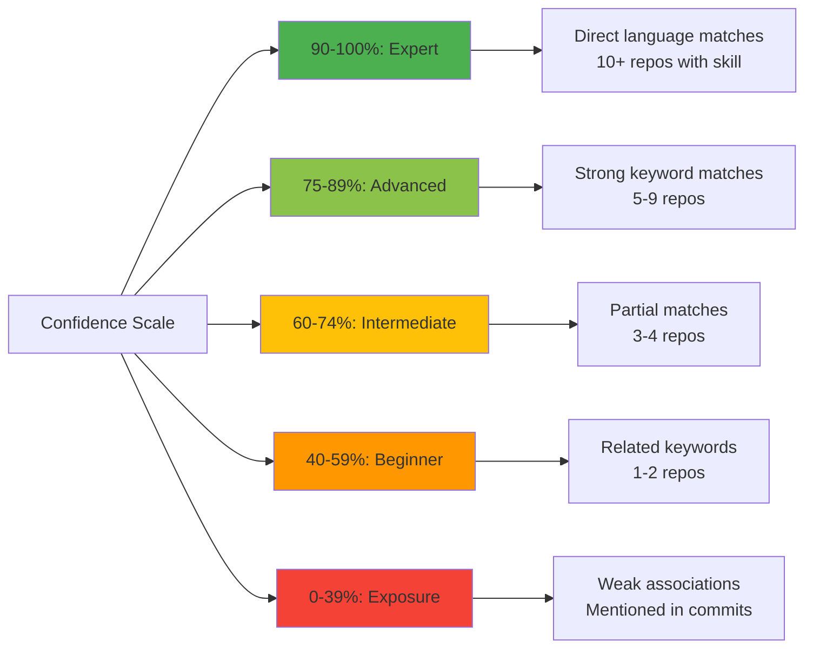

## Performance Optimization

### Skill Index Strategy

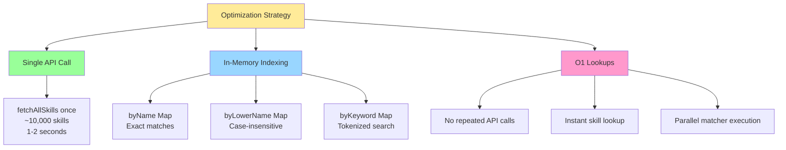

**Before vs After:**
- **Before**: 100+ API calls per user (fuzzy match, semantic search for each language)
- **After**: 1 API call per session (fetch all skills once, match locally)
- **Speed**: 10-30 seconds → 2-5 seconds
- **Reliability**: Network failures → None (local matching)

## Error Handling

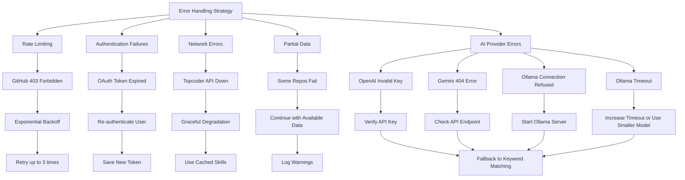

**Error Recovery Strategies:**

| Error Type | Detection | Recovery | Fallback |
|------------|-----------|----------|----------|
| **Rate Limiting** | HTTP 403 | Exponential backoff, retry | Wait and continue |
| **Auth Failure** | Invalid token | Re-authenticate | Request new OAuth |
| **Network Error** | Connection timeout | Retry with timeout | Use cached data |
| **Partial Data** | Some requests fail | Continue processing | Log warnings only |
| **AI Provider** | Various | Provider-specific | Keyword matching |

**AI Provider Error Handling:**

- **OpenAI Invalid Key**: Verify key at platform.openai.com → Fallback to keyword matching
- **Gemini 404**: Check API endpoint version → Fallback to keyword matching  
- **Ollama Connection Refused**: Check `ollama serve` running → Fallback to keyword matching
- **Ollama Timeout**: Increase timeout (`--ollama-timeout 300`), use smaller model (`llama3.2:1b`), or reduce data (`--max-repos 10`)


## Output Formats

### Text Format
```
🎯 Topcoder Skill Recommendations for octocat
═══════════════════════════════════════════

1. JavaScript (98% confidence)
   Evidence:
   • Language: frontend-app (42 contributions)
   • Language: backend-api (38 contributions)
   • Repository: js-toolkit (topic: javascript)
   Found by: Language Matcher, Repository Matcher

2. React (95% confidence)
   Evidence:
   • Language: react-dashboard (56 contributions)
   • Repository: react-components (description: "React UI library")
   Found by: Language Matcher, Hybrid Matcher
```

### JSON Format
```json
{
  "username": "octocat",
  "matcher": "hybrid",
  "minConfidence": 50,
  "recommendations": [
    {
      "skillId": "abc123",
      "skillName": "JavaScript",
      "confidence": 98,
      "evidence": [
        {
          "type": "language",
          "source": "frontend-app",
          "details": "42 contributions",
          "url": "https://github.com/octocat/frontend-app"
        }
      ],
      "rationale": "Exact language match with high frequency",
      "sources": ["Language Matcher", "Repository Matcher"]
    }
  ]
}
```

## CLI Interface

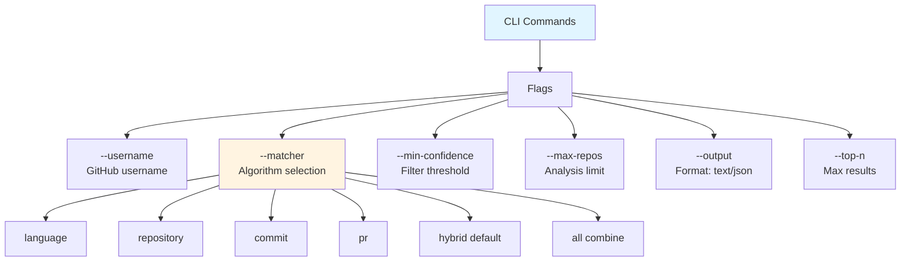

**Example Usage:**
```bash
# Default (hybrid matcher, min 50% confidence)
npm start -- --username octocat

# Language-only matching
npm start -- --username octocat --matcher language

# High confidence only
npm start -- --username octocat --min-confidence 75

# JSON output for API integration
npm start -- --username octocat --output json > results.json

# Run all matchers and combine
npm start -- --username octocat --matcher all --top-n 20
```

## Security & Privacy

- **OAuth Token Storage**: Stored in `.github-token` file (gitignored)
- **No Data Persistence**: GitHub profile data not stored, processed in-memory only
- **API Keys**: Environment variables for any optional AI providers
- **Rate Limits**: Respects GitHub API limits (5000/hour authenticated)

## Extensibility

The architecture supports easy addition of new matchers - see [PLUGIN_GUIDE.md](PLUGIN_GUIDE.md) for step-by-step instructions.

---

## AI Provider Deep Dive

### LLM-Based vs Embedding-Based Matching

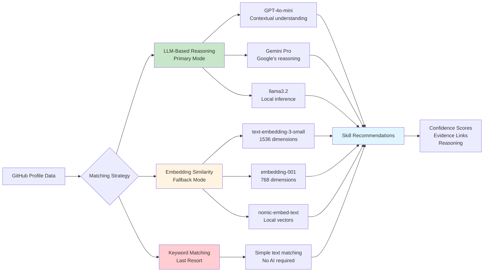

### Provider Implementation Details

#### OpenAI Provider
```typescript
class OpenAIProvider implements ISemanticProvider {
  name = 'OpenAI';
  supportsLLM = true;
  
  // LLM-based reasoning (primary)
  async matchSkillsWithLLM(profile: string, skills: string[]) {
    const prompt = `Analyze this GitHub profile and match to skills...`;
    const response = await openai.chat.completions.create({
      model: 'gpt-4o-mini',
      temperature: 0.3,
      messages: [{ role: 'user', content: prompt }]
    });
    // Returns: [{skill, confidence, reasoning}]
  }
  
  // Embedding fallback
  async computeSimilarity(text1: string, text2: string) {
    const embeddings = await openai.embeddings.create({
      model: 'text-embedding-3-small',
      input: [text1, text2]
    });
    return cosineSimilarity(embeddings[0], embeddings[1]);
  }
}
```

**Costs (as of 2026):**
- GPT-4o-mini: $0.15 per 1M input tokens, $0.60 per 1M output tokens
- text-embedding-3-small: $0.02 per 1M tokens
- **Typical analysis**: ~$0.15-$0.20 per user

#### Gemini Provider
```typescript
class GeminiProvider implements ISemanticProvider {
  name = 'Google Gemini';
  supportsLLM = true;
  
  // LLM-based reasoning (primary)
  async matchSkillsWithLLM(profile: string, skills: string[]) {
    const response = await fetch(
      'https://generativelanguage.googleapis.com/v1beta/models/gemini-pro:generateContent',
      {
        method: 'POST',
        body: JSON.stringify({
          contents: [{ parts: [{ text: prompt }] }]
        })
      }
    );
    // Parse structured response
  }
  
  // Embedding fallback
  async computeSimilarity(text1: string, text2: string) {
    const embeddings = await generateEmbeddings('embedding-001', [text1, text2]);
    return cosineSimilarity(embeddings[0], embeddings[1]);
  }
}
```

**Costs (as of 2026):**
- Gemini Pro: $0.075 per 1M input tokens, $0.30 per 1M output tokens
- embedding-001: Free up to quota
- **Typical analysis**: ~$0.10-$0.15 per user

#### Ollama Provider (Local)
```typescript
class OllamaProvider implements ISemanticProvider {
  name = 'Ollama (Local)';
  supportsLLM = true;
  
  // Check availability
  async isAvailable(): Promise<boolean> {
    try {
      const response = await axios.get(`${this.baseUrl}/api/tags`, { timeout: 5000 });
      return response.status === 200;
    } catch {
      return false;
    }
  }
  
  // LLM-based reasoning (primary)
  async matchSkillsWithLLM(profile: string, skills: string[]) {
    const response = await axios.post(`${this.baseUrl}/api/generate`, {
      model: this.model, // llama3.2
      prompt: `Analyze this profile and match skills...`,
      stream: false
    }, { timeout: 60000 });
    // Parse response
  }
  
  // Embedding fallback
  async computeSimilarity(text1: string, text2: string) {
    const embeddings = await this.generateEmbeddings([text1, text2]);
    return cosineSimilarity(embeddings[0], embeddings[1]);
  }
}
```

**Benefits:**
- ✅ 100% local - no data leaves your machine
- ✅ Free - no API costs
- ✅ Privacy-focused
- ✅ No internet required (after model download)
- ✅ Customizable models

### Caching Strategy

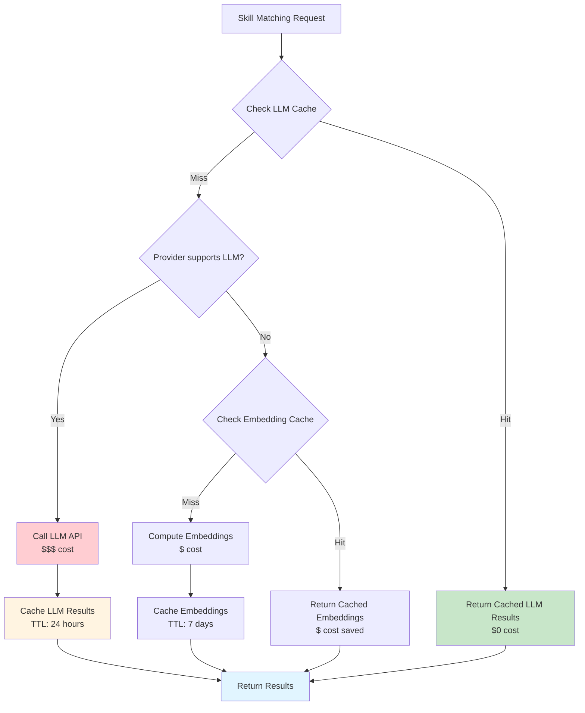

**Cache Keys:**
- LLM: `llm:${provider}:${profileHash}:${skillsHash}`
- Embeddings: `embed:${provider}:${textHash}`

**TTL Strategy:**
- LLM results: 24 hours (profiles change frequently)
- Embeddings: 7 days (skill descriptions stable)

### Performance Comparison

| Provider | Cold Start | Cached | Accuracy | Privacy | Cost |
|----------|-----------|--------|----------|---------|------|
| **OpenAI** | 3-5s | <1s | ⭐⭐⭐⭐⭐ | ❌ Cloud | $0.20 |
| **Gemini** | 2-4s | <1s | ⭐⭐⭐⭐ | ❌ Cloud | $0.15 |
| **Ollama** | 5-10s | <1s | ⭐⭐⭐⭐ | ✅ Local | Free |
| **Keyword** | <1s | <1s | ⭐⭐⭐ | ✅ Local | Free |

### Batch Processing

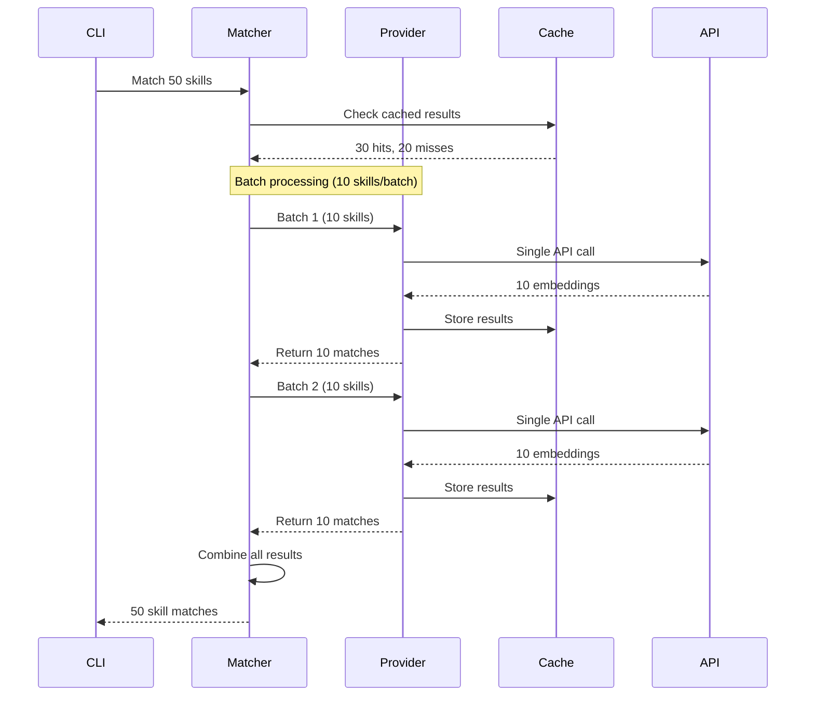

**Optimization:**
- ✅ Batch embeddings (10 skills per API call)
- ✅ Cache aggressively
- ✅ Parallel processing where possible
- ✅ Fallback gracefully (LLM → Embedding → Keyword)
