# Design Flow & Architecture Diagrams

This document provides visual representations of the system's design, data flow, and decision-making processes.

## 1. System Overview

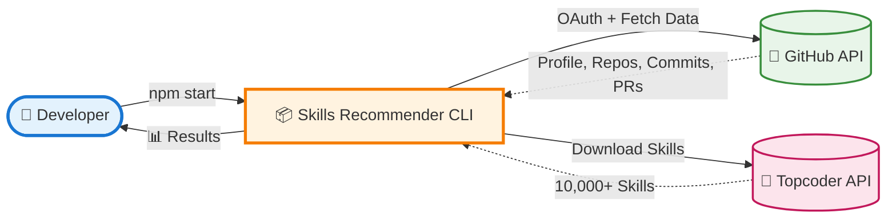

### 📋 Process Flow

| Step | Action | Details |
|------|--------|---------|
| **1️⃣ Launch** | User runs `npm start` | Single command execution |
| **2️⃣ Auth** | GitHub OAuth authentication | Device flow, token saved to `.github-token` |
| **3️⃣ Collect** | Fetch GitHub data | Repos, commits, PRs, languages (paginated) |
| **4️⃣ Download** | Get Topcoder skills | ~10,000 skills in one API call |
| **5️⃣ Index** | Build search index | Creates 3 maps: byName, byLowerName, byKeyword |
| **6️⃣ Match** | Run algorithm(s) | 100% local matching, zero additional API calls |
| **7️⃣ Display** | Show results | Ranked skills with confidence scores + evidence |

### 🎯 Key Benefits

- **⚡ Fast**: 2-5 seconds total (vs 30-60s with API-based matching)
- **🔒 Secure**: OAuth token stored locally, reused for future runs
- **📊 Evidence-Based**: Every skill includes verifiable GitHub links
- **🔄 Flexible**: 6+ matching algorithms to choose from

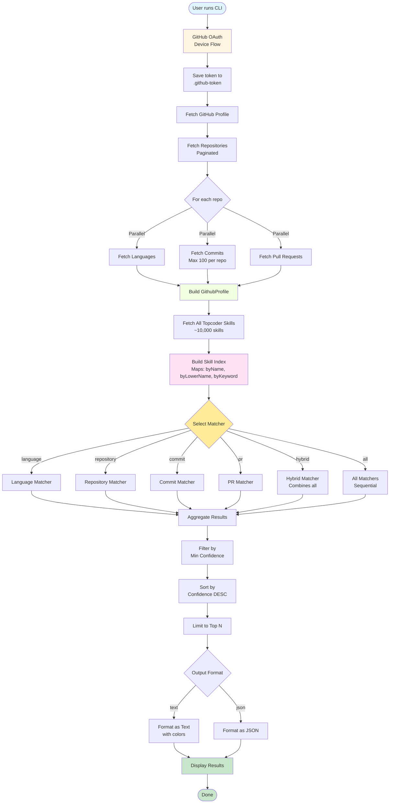

## 2. Complete Data Flow


## 3. AI Provider Selection Flow

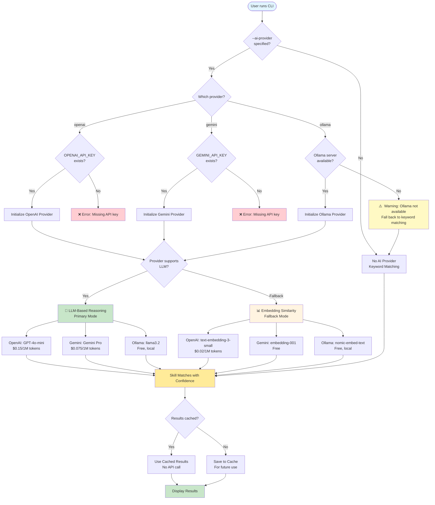

**Key Decision Points:**

1. **Provider Selection** - User chooses OpenAI, Gemini, Ollama, or none
2. **Credential Validation** - API keys checked for cloud providers
3. **Availability Check** - Ollama server connectivity tested
4. **Matching Mode** - LLM reasoning preferred over embeddings
5. **Caching** - Results cached to minimize API costs

**Matching Quality Hierarchy:**
```
🥇 LLM-Based Reasoning (OpenAI/Gemini/Ollama)
   ↓ (if unavailable or rate limited)
🥈 Embedding Similarity (Vector search)
   ↓ (if provider unavailable)
🥉 Keyword Matching (Basic text search)
```

## 4. Matcher Selection Decision Tree

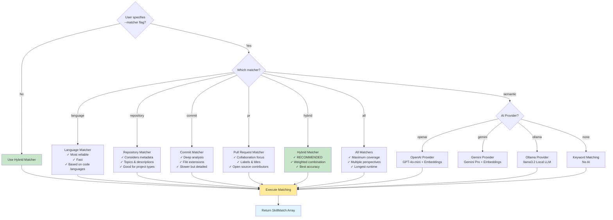

## 4. Language Matcher Algorithm

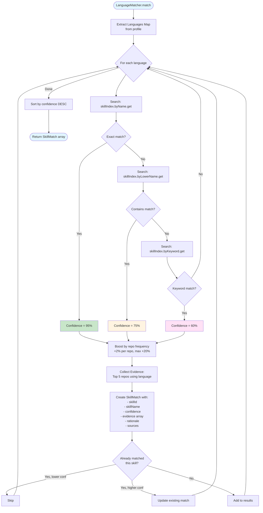

## 5. Hybrid Matcher Weighted Combination

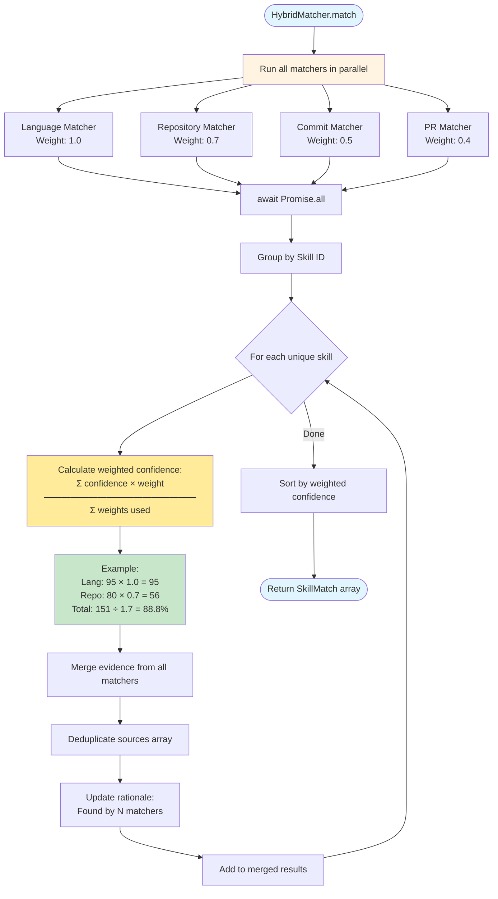

## 6. Skill Index Lookup Performance

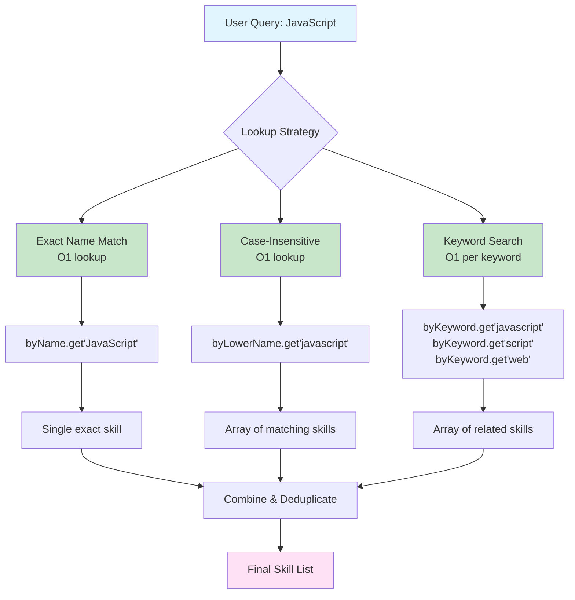

**Performance Comparison:**

| Approach | API Calls | Time | Reliability |
|----------|-----------|------|-------------|
| **Old (API-based)** | 100+ per user | 30-60s | Low (network dependent) |
| **New (Index-based)** | 1 per session | 2-5s | High (local lookup) |

## 7. Confidence Score Calculation

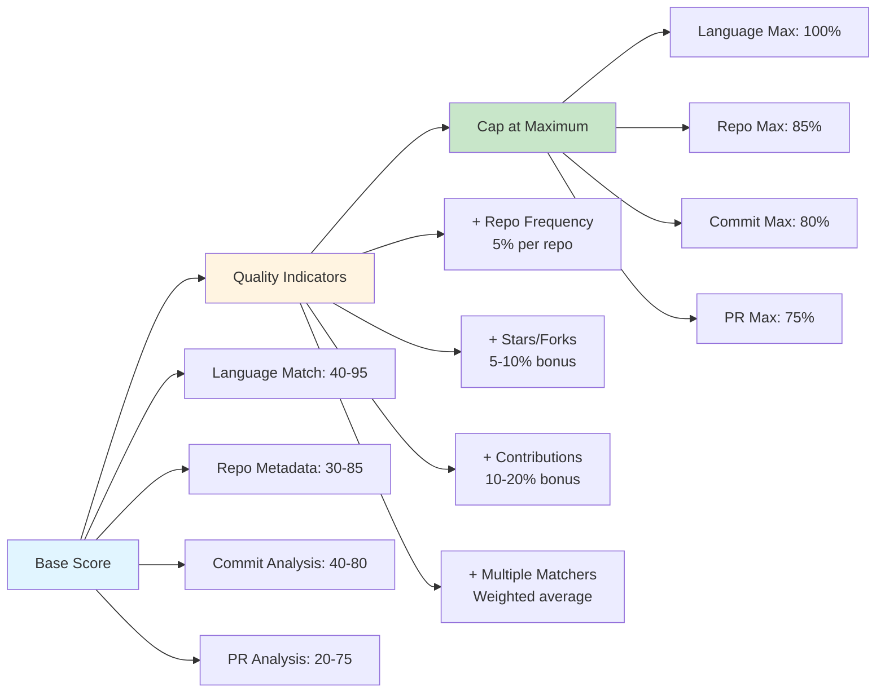

## 8. Evidence Collection Process

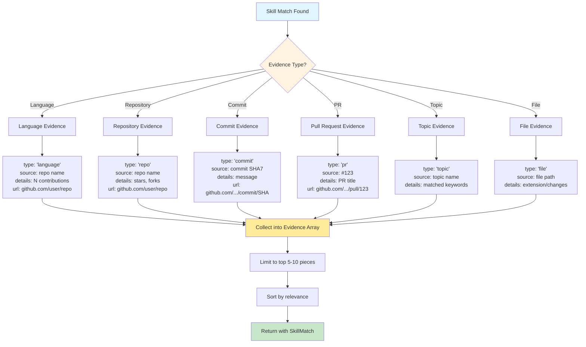

## 9. Error Handling & Retry Logic

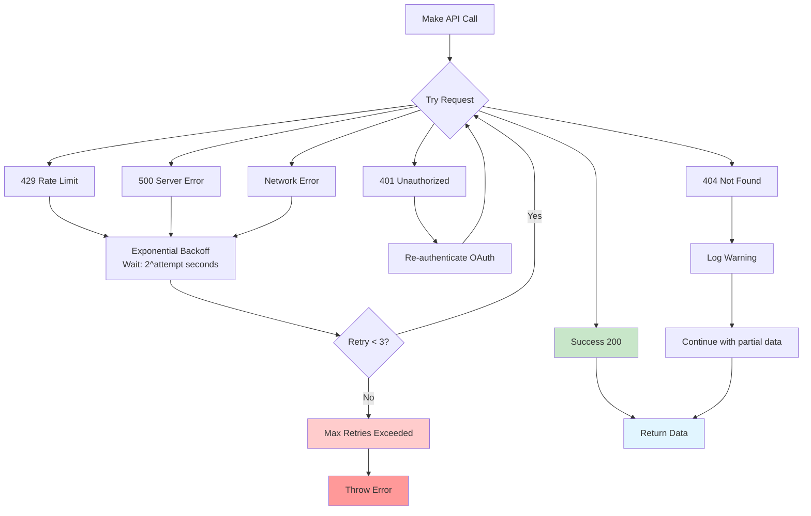

## 10. CLI Execution Flow

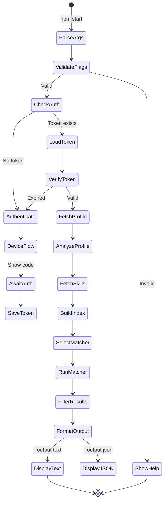

## 11. Plugin Architecture

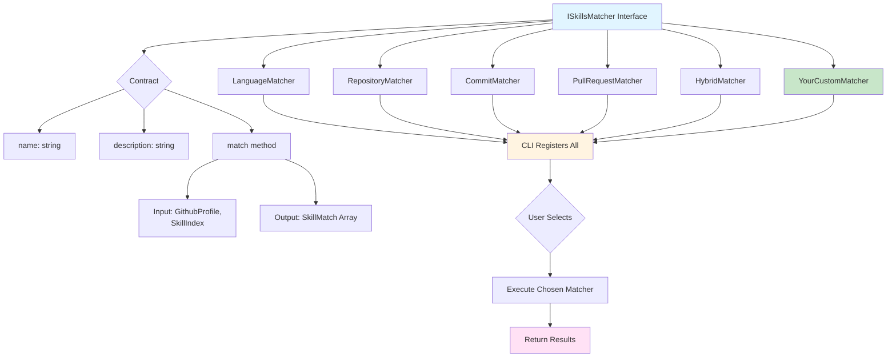

**Adding a new matcher:**
1. Create class implementing `ISkillsMatcher`
2. Add to CLI switch statement
3. Optionally add to `HybridMatcher`
4. Done! No other code changes needed.

## 12. Rate Limiting Strategy

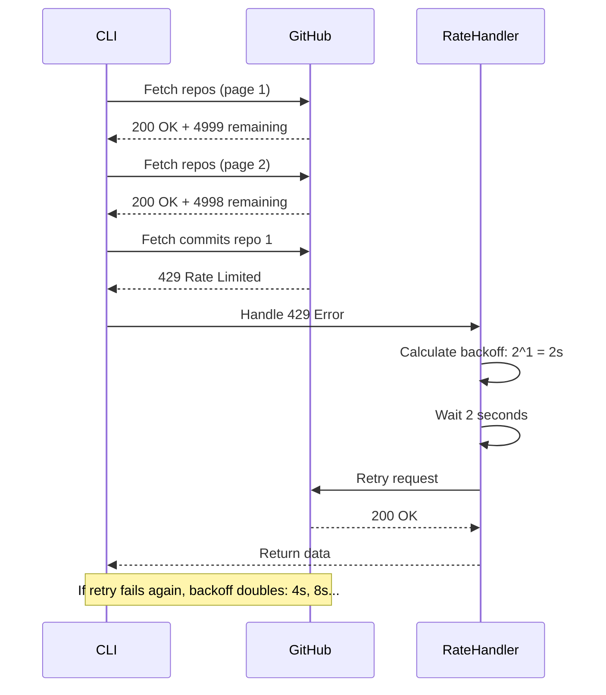

## 13. Memory & Performance

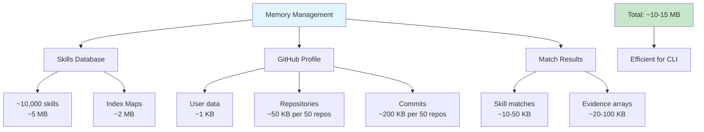

**Performance Targets:**
- Full analysis: 2-5 seconds
- Memory usage: <50 MB
- API calls: 10-50 (depending on repo count)
- Output generation: <100ms

## 14. Future Enhancements

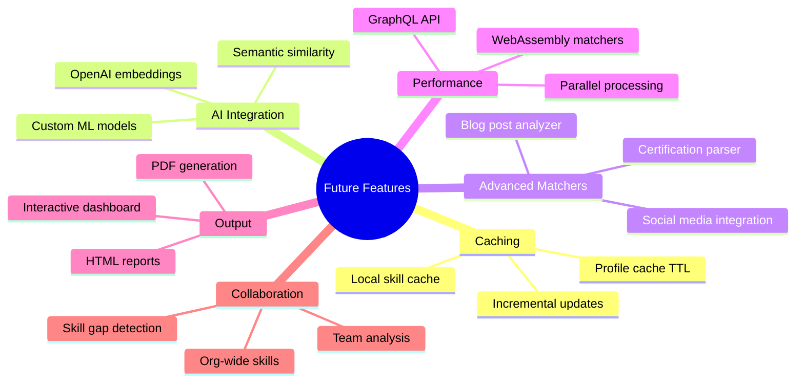

---

## Summary

This system is designed for:
- ✅ **Speed**: Local matching with O(1) lookups
- ✅ **Accuracy**: Multiple specialized matchers
- ✅ **Extensibility**: Plug-and-play architecture
- ✅ **Evidence**: Traceable recommendations
- ✅ **Flexibility**: CLI flags for customization

See [ARCHITECTURE.md](ARCHITECTURE.md) for detailed component documentation.
