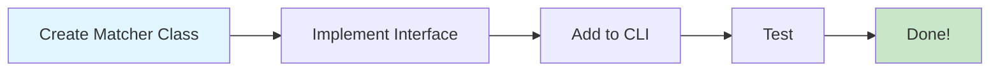

# Plugin Guide: Adding New Skill Matchers

This guide shows you how to add new matching algorithms to the Topcoder Skills Recommender. The system is designed to be **plug-and-play** - new matchers can be added without modifying existing code.

## Quick Start



**Time to add new matcher:** ~15 minutes

## Step-by-Step Guide

### Step 1: Create Matcher File

Create a new file in `src/matchers/` directory:

```bash
src/matchers/YourNewMatcher.ts
```

### Step 2: Implement ISkillsMatcher Interface

```typescript
import { ISkillsMatcher, SkillMatch, GithubProfile, Evidence } from './ISkillsMatcher';
import { SkillIndex } from '../topcoder';

export class YourNewMatcher implements ISkillsMatcher {
  // Required: Matcher name (displayed in output)
  name = 'Your New Matcher';
  
  // Required: Short description of what this matcher does
  description = 'Matches skills based on [your strategy]';
  
  // Required: Main matching logic
  async match(profile: GithubProfile, skillIndex: SkillIndex): Promise<SkillMatch[]> {
    const matches: SkillMatch[] = [];
    
    // 1. Analyze GitHub profile data
    // 2. Search skill index for matches
    // 3. Calculate confidence scores
    // 4. Collect evidence
    // 5. Return skill matches
    
    return matches;
  }
}
```

### Step 3: Understand the Data Structures

#### GithubProfile Interface
```typescript
interface GithubProfile {
  username: string;
  name: string | null;
  bio: string | null;
  repos: RepoData[];           // List of repositories
  languages: Map<string, number>; // Language → Repo count
}

interface RepoData {
  name: string;
  fullName: string;            // owner/repo
  description: string | null;
  languages: Record<string, number>; // Language → Bytes
  topics: string[];
  stars: number;
  forks: number;
  contributions?: number;
  commits?: CommitData[];
  pullRequests?: PullRequestData[];
}

interface CommitData {
  sha: string;
  message: string;
  author: string;
  date: string;
  filesChanged: string[];      // File paths
}

interface PullRequestData {
  number: number;
  title: string;
  body: string | null;
  state: string;
  labels: string[];
  createdAt: string;
  mergedAt: string | null;
}
```

#### SkillIndex Structure
```typescript
interface SkillIndex {
  byName: Map<string, TopcoderSkill>;        // Exact name lookup
  byLowerName: Map<string, TopcoderSkill[]>; // Case-insensitive
  byKeyword: Map<string, TopcoderSkill[]>;   // Keyword search
  all: TopcoderSkill[];                      // All skills
}

interface TopcoderSkill {
  id: string;
  name: string;
  description?: string;
  metadata?: {
    category?: string;
    subcategory?: string;
  };
}
```

#### SkillMatch Return Type
```typescript
interface SkillMatch {
  skillId: string;              // Topcoder skill ID
  skillName: string;            // Display name
  confidence: number;           // 0-100 score
  evidence: Evidence[];         // Proof from GitHub
  rationale: string;            // Human-readable explanation
  sources: string[];            // Which matchers found this
}

interface Evidence {
  type: 'repo' | 'commit' | 'pr' | 'language' | 'topic' | 'file';
  source: string;               // Repo name, commit SHA, etc.
  details?: string;             // Additional context
  url?: string;                 // GitHub URL for verification
}
```

### Step 4: Implementation Patterns

#### Pattern 1: Language-Based Matching
```typescript
async match(profile: GithubProfile, skillIndex: SkillIndex): Promise<SkillMatch[]> {
  const matches: SkillMatch[] = [];
  
  // Iterate through user's languages
  for (const [language, repoCount] of profile.languages) {
    // Search skill index
    const lowerLang = language.toLowerCase();
    const exactMatch = skillIndex.byName.get(language);
    const fuzzyMatches = skillIndex.byLowerName.get(lowerLang) || [];
    const keywordMatches = skillIndex.byKeyword.get(lowerLang) || [];
    
    // Combine results
    const allMatches = [
      ...(exactMatch ? [exactMatch] : []),
      ...fuzzyMatches,
      ...keywordMatches
    ];
    
    for (const skill of allMatches) {
      // Calculate confidence
      let confidence = 70; // Base score
      if (exactMatch && skill.id === exactMatch.id) confidence = 95;
      confidence += Math.min(repoCount * 5, 20); // Frequency boost
      
      // Collect evidence
      const evidence: Evidence[] = profile.repos
        .filter(repo => Object.keys(repo.languages || {}).includes(language))
        .map(repo => ({
          type: 'language' as const,
          source: repo.fullName,
          details: `${repo.contributions || 0} contributions`,
          url: `https://github.com/${repo.fullName}`
        }))
        .slice(0, 5); // Top 5 repos
      
      matches.push({
        skillId: skill.id,
        skillName: skill.name,
        confidence: Math.min(confidence, 100),
        evidence,
        rationale: `Matched via ${language} in ${repoCount} repositories`,
        sources: [this.name]
      });
    }
  }
  
  return matches.sort((a, b) => b.confidence - a.confidence);
}
```

#### Pattern 2: Keyword Extraction
```typescript
// Extract keywords from text
function extractKeywords(text: string): string[] {
  return text
    .toLowerCase()
    .split(/[\s\-_\.\,\/]+/)
    .filter(word => word.length > 2) // Filter short words
    .filter(word => !STOP_WORDS.has(word)); // Remove common words
}

// Usage
const keywords = extractKeywords(repo.description || '');
for (const keyword of keywords) {
  const matches = skillIndex.byKeyword.get(keyword) || [];
  // Process matches...
}
```

#### Pattern 3: Confidence Calculation
```typescript
// Base confidence + frequency boost + quality indicators
let confidence = 40; // Base score

// Frequency boost
confidence += Math.min(occurrences * 5, 30);

// Quality indicators
if (repo.stars > 100) confidence += 10;
if (repo.forks > 50) confidence += 5;
if (repo.contributions && repo.contributions > 100) confidence += 15;

// Cap at maximum
confidence = Math.min(confidence, 95);
```

#### Pattern 4: Evidence Collection
```typescript
const evidence: Evidence[] = [];

// From repositories
evidence.push({
  type: 'repo',
  source: repo.fullName,
  details: `${repo.stars}★, ${repo.forks} forks`,
  url: `https://github.com/${repo.fullName}`
});

// From commits
evidence.push({
  type: 'commit',
  source: commit.sha.substring(0, 7),
  details: commit.message,
  url: `https://github.com/${repo.fullName}/commit/${commit.sha}`
});

// From pull requests
evidence.push({
  type: 'pr',
  source: `#${pr.number}`,
  details: pr.title,
  url: `https://github.com/${repo.fullName}/pull/${pr.number}`
});
```

### Step 5: Add to CLI

Edit `src/cli.ts` to include your matcher:

```typescript
import { YourNewMatcher } from './matchers/YourNewMatcher';

// In the main function, add to matcher selection:
let matcher: ISkillsMatcher;

switch (options.matcher) {
  case 'language':
    matcher = new LanguageMatcher();
    break;
  case 'repository':
    matcher = new RepositoryMatcher();
    break;
  // ... existing cases ...
  case 'yournew': // ← Add this
    matcher = new YourNewMatcher();
    break;
  default:
    matcher = new HybridMatcher();
}
```

Update the CLI help text:
```typescript
.option('--matcher <type>', 'Matcher algorithm to use', 
  'language|repository|commit|pr|yournew|hybrid|all')
```

### Step 6: Add to Hybrid Matcher (Optional)

If you want your matcher included in the "hybrid" and "all" modes:

Edit `src/matchers/HybridMatcher.ts`:

```typescript
import { YourNewMatcher } from './YourNewMatcher';

export class HybridMatcher implements ISkillsMatcher {
  private matchers: { matcher: ISkillsMatcher; weight: number }[] = [
    { matcher: new LanguageMatcher(), weight: 1.0 },
    { matcher: new RepositoryMatcher(), weight: 0.7 },
    { matcher: new CommitMatcher(), weight: 0.5 },
    { matcher: new PullRequestMatcher(), weight: 0.4 },
    { matcher: new YourNewMatcher(), weight: 0.6 } // ← Add here with weight
  ];
  // ... rest of implementation
}
```

### Step 7: Test Your Matcher

```bash
# Build
npm run build

# Test with a real GitHub user
npm start -- --username octocat --matcher yournew

# Test with confidence filter
npm start -- --username octocat --matcher yournew --min-confidence 60

# Test JSON output
npm start -- --username octocat --matcher yournew --output json
```

## Example: ContributionMatcher

Here's a complete example that matches skills based on contribution intensity:

```typescript
import { ISkillsMatcher, SkillMatch, GithubProfile, Evidence } from './ISkillsMatcher';
import { SkillIndex } from '../topcoder';

export class ContributionMatcher implements ISkillsMatcher {
  name = 'Contribution Matcher';
  description = 'Matches skills based on contribution intensity and frequency';
  
  async match(profile: GithubProfile, skillIndex: SkillIndex): Promise<SkillMatch[]> {
    const skillContributions = new Map<string, {
      skill: any;
      totalContributions: number;
      repos: { repo: string; contributions: number; url: string }[];
    }>();
    
    // Analyze each repository
    for (const repo of profile.repos) {
      if (!repo.contributions || repo.contributions < 5) continue; // Skip minor contributions
      
      // Extract skills from languages
      for (const language of Object.keys(repo.languages || {})) {
        const matches = skillIndex.byLowerName.get(language.toLowerCase()) || [];
        
        for (const skill of matches) {
          if (!skillContributions.has(skill.id)) {
            skillContributions.set(skill.id, {
              skill,
              totalContributions: 0,
              repos: []
            });
          }
          
          const data = skillContributions.get(skill.id)!;
          data.totalContributions += repo.contributions;
          data.repos.push({
            repo: repo.fullName,
            contributions: repo.contributions,
            url: `https://github.com/${repo.fullName}`
          });
        }
      }
    }
    
    // Convert to skill matches
    const matches: SkillMatch[] = [];
    
    for (const [skillId, data] of skillContributions) {
      // Confidence based on contribution intensity
      let confidence = 30; // Base
      
      // Scale by total contributions
      if (data.totalContributions > 1000) confidence += 40;
      else if (data.totalContributions > 500) confidence += 30;
      else if (data.totalContributions > 100) confidence += 20;
      else confidence += 10;
      
      // Boost by number of repos
      confidence += Math.min(data.repos.length * 5, 25);
      
      // Cap at 95
      confidence = Math.min(confidence, 95);
      
      // Build evidence
      const evidence: Evidence[] = data.repos
        .sort((a, b) => b.contributions - a.contributions)
        .slice(0, 5)
        .map(r => ({
          type: 'repo' as const,
          source: r.repo,
          details: `${r.contributions} contributions`,
          url: r.url
        }));
      
      matches.push({
        skillId: data.skill.id,
        skillName: data.skill.name,
        confidence,
        evidence,
        rationale: `${data.totalContributions} total contributions across ${data.repos.length} repositories`,
        sources: [this.name]
      });
    }
    
    return matches.sort((a, b) => b.confidence - a.confidence);
  }
}
```

## Best Practices

### DO ✅
- **Use skill index efficiently**: O(1) lookups via maps
- **Provide clear evidence**: Include URLs and context
- **Calculate meaningful confidence**: Base score + indicators
- **Handle missing data**: Check for null/undefined
- **Sort results**: By confidence descending
- **Limit results**: Slice to top N to avoid overwhelming output
- **Write descriptive rationale**: Help users understand the match

### DON'T ❌
- **Make API calls**: Use skill index, not Topcoder API
- **Return duplicate skills**: Deduplicate by skill ID
- **Ignore confidence ranges**: Keep 0-100 scale
- **Forget error handling**: Try-catch for robust matching
- **Hard-code thresholds**: Consider making them configurable
- **Mutate input data**: Keep profile and skillIndex read-only

## Testing Checklist

- [ ] Builds without errors (`npm run build`)
- [ ] Returns SkillMatch[] with all required fields
- [ ] Confidence scores in 0-100 range
- [ ] Evidence array not empty for high-confidence matches
- [ ] Works with empty/minimal profiles
- [ ] Handles null/undefined data gracefully
- [ ] No duplicate skill IDs in results
- [ ] Results sorted by confidence descending
- [ ] Rationale is human-readable
- [ ] JSON output valid

## Advanced: Integrating AI/ML Models

Want to use machine learning for matching? Here's the pattern:

```typescript
import axios from 'axios';

export class AIModelMatcher implements ISkillsMatcher {
  name = 'AI Model Matcher';
  description = 'Uses ML model for semantic skill matching';
  
  constructor(private apiEndpoint: string, private apiKey: string) {}
  
  async match(profile: GithubProfile, skillIndex: SkillIndex): Promise<SkillMatch[]> {
    // Build feature vector from profile
    const features = this.extractFeatures(profile);
    
    // Call ML model API
    const predictions = await axios.post(this.apiEndpoint, {
      features,
      skills: skillIndex.all.map(s => ({ id: s.id, name: s.name }))
    }, {
      headers: { 'Authorization': `Bearer ${this.apiKey}` }
    });
    
    // Convert predictions to skill matches
    return predictions.data.map((pred: any) => ({
      skillId: pred.skillId,
      skillName: pred.skillName,
      confidence: pred.probability * 100,
      evidence: this.buildEvidence(profile, pred.skillName),
      rationale: `ML model prediction (${pred.model_version})`,
      sources: [this.name]
    }));
  }
  
  private extractFeatures(profile: GithubProfile) {
    // Extract numerical features for ML model
    return {
      total_repos: profile.repos.length,
      total_languages: profile.languages.size,
      total_commits: profile.repos.reduce((sum, r) => sum + (r.commits?.length || 0), 0),
      total_prs: profile.repos.reduce((sum, r) => sum + (r.pullRequests?.length || 0), 0),
      language_distribution: Array.from(profile.languages.entries()),
      // ... more features
    };
  }
  
  private buildEvidence(profile: GithubProfile, skillName: string): Evidence[] {
    // Find repos that support this skill prediction
    return profile.repos
      .filter(r => this.repoSupportsSkill(r, skillName))
      .map(r => ({
        type: 'repo' as const,
        source: r.fullName,
        details: 'Identified by ML model',
        url: `https://github.com/${r.fullName}`
      }))
      .slice(0, 3);
  }
  
  private repoSupportsSkill(repo: RepoData, skillName: string): boolean {
    const text = `${repo.name} ${repo.description} ${Object.keys(repo.languages || {}).join(' ')}`.toLowerCase();
    return text.includes(skillName.toLowerCase());
  }
}
```

## Community Matchers

Share your matcher with the community! Consider these ideas:

1. **CertificationMatcher**: Parse certifications from profile README
2. **BlogPostMatcher**: Analyze linked blog posts for skills
3. **SocialMatcher**: Consider Twitter/LinkedIn mentions
4. **TimeTrendMatcher**: Weight recent activity higher
5. **CollaborationMatcher**: Consider contributor networks
6. **QualityMatcher**: Focus on well-maintained repos (stars, issues, CI)

## Troubleshooting

**Matcher not showing up in CLI:**
- Check import statement in `src/cli.ts`
- Verify case name matches in switch statement
- Rebuild: `npm run build`

**Build errors:**
- Ensure class implements `ISkillsMatcher` correctly
- Check all required properties: `name`, `description`, `match`
- Verify return type is `Promise<SkillMatch[]>`

**Low confidence scores:**
- Review confidence calculation formula
- Check if evidence is being collected
- Consider boosting scores for strong signals

**No results returned:**
- Add console logging to debug
- Verify skillIndex search is working
- Check if profile data is present

## Need Help?

- Review existing matchers in `src/matchers/` for examples
- Check [ARCHITECTURE.md](ARCHITECTURE.md) for system design
- See [CLI_USAGE.md](CLI_USAGE.md) for CLI details

Happy matching! 🎯
